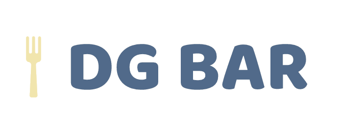
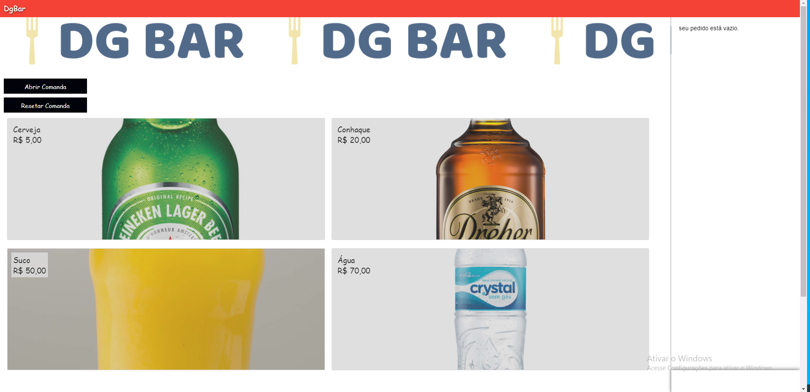
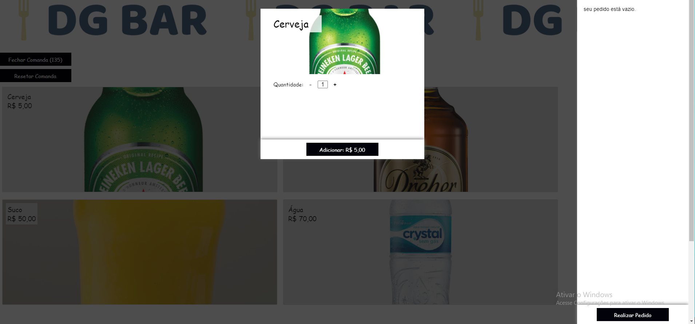
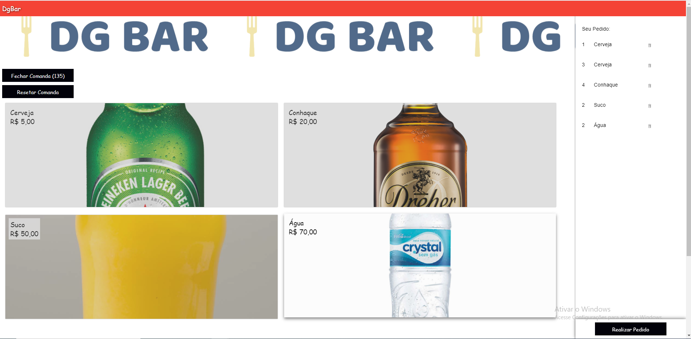
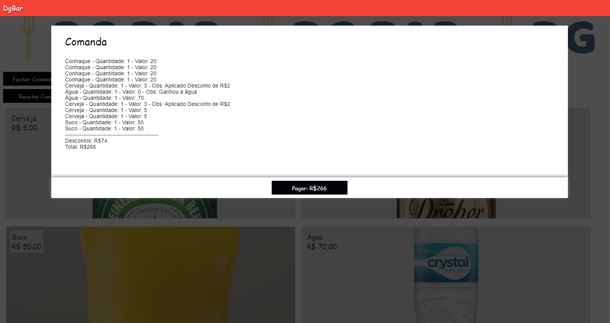

  

## Começando
Para executar a aplicação:

A aplicação react (front-end) poderá ser acessada através do endpoint `http://localhost:3000/` e a api (back-end) pode ser acessada via endpoint `http://localhost:5001/`.

## Sobre
O projeto **DgBar** simula um sistema de comanda, contendo a área de registros dos pedidos, permitindo também validações e descontos nos produtos..

## Atenção
Este é um projeto para avaliação técnica da ClearSale. Ele demonstra uso de tecnologias e arquitetura. **Existem ajustes e melhorias a serem feitos**.

## Fluxo
- O usuário pode optar por Abrir a Comanda ou adicionar os pedidos.
- Ao adicionar os pedidos o usuário informa a quantidade de produtos que deseja cadastrar.
- Para poder realizar o pedido, o usuário deve ter acionado o botão de Abrir Comanda.
- O usuário poderá adicionar e realizar quantos pedidos quiser.
- Quando o usuário desejar, ele pode Fechar a Comanda
- No menu de Fechar a Comanda o usuário irá a receber nota fiscal que o cliente irá pagar discriminando os itens comprados, o desconto aplicado e o valor total no final.

## Informações importantes
- Na compra de 1 cerveja e 1 suco, essa cerveja sai por 3 reais
- Se o cliente comprar 3 conhaques mais 2 cervejas, poderá pedir uma água de graça.
- Só é permitido 3 sucos por comanda.
- As promoções são cumulativas e podem ser usadas nos mesmos itens.

## Imagens

  

  

  

  

## Autor 👦
* **Paulo Campez** - *Desenvolvedor* - [GitHub](https://github.com/paulocampez) - [Linkedin](https://www.linkedin.com/in/paulocampez/)

## License 📃

This project is licensed under the MIT License - see the [LICENSE](LICENSE) file for details
